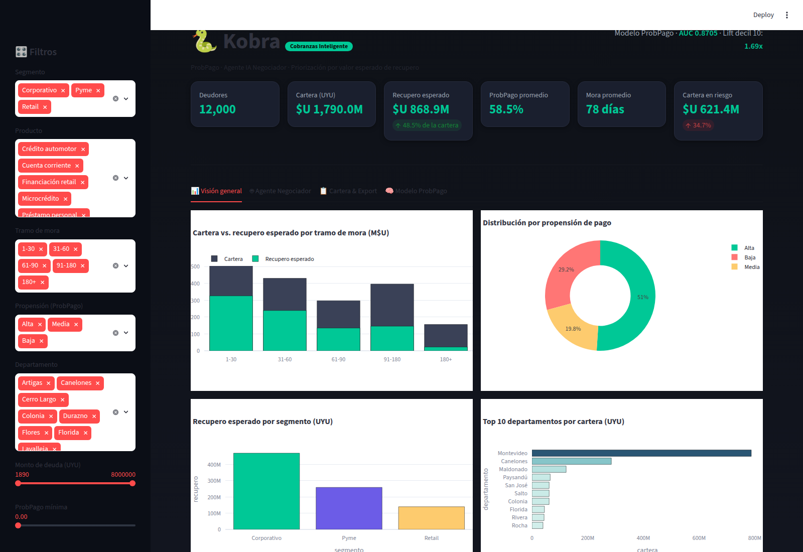

# 🐍 Kobra · Plataforma de Cobranzas Inteligente

**Kobra** convierte una cartera de cobranzas en un plan de acción priorizado.
Combina un modelo de **probabilidad de pago (ProbPago)** con un **Agente IA
Negociador** que recomienda la mejor estrategia, descuento, canal y hasta el
guion listo para enviar — todo dentro de un dashboard gerencial con KPIs,
filtros, gráficos y exportación a Excel/CSV.

> Demo lista para vender a cualquier empresa con cartera vencida (banca,
> financieras, retail, telco, utilities, fintech). Pensada para **Uruguay**,
> con **datos sintéticos y sin nombres de clientes** — sin problemas legales.

---

## 🎯 Qué resuelve

| Problema tradicional | Con Kobra |
|---|---|
| Se gestiona igual a todos los deudores | Se prioriza por **valor esperado de recupero** |
| Descuentos y planes "a ojo" | Decisiones según **probabilidad de pago** |
| No se sabe a quién contactar primero | Ranking operativo automático |
| Guiones de negociación improvisados | **Guion generado** por el agente IA |
| Reporting manual y lento | **Dashboard + export a Excel/CSV** |

---

## 🏗️ Arquitectura (end-to-end)

```
Cartera (CSV)
   │
   ├─►  ProbPago  (kobra/probpago.py)      Gradient Boosting → probabilidad de pago
   │
   ├─►  Agente Negociador (kobra/negociador.py)   estrategia + descuento + canal + guion
   │
   ├─►  Pipeline (kobra/pipeline.py)       orquesta todo y exporta
   │        ├─ outputs/kobra_scored.csv / .xlsx
   │        ├─ outputs/kobra_bundle.json
   │        └─ dashboard_estatico/kobra_data.js
   │
   ├─►  Dashboard Streamlit (app/app.py)   KPIs · filtros · gráficos · export
   ├─►  Dashboard estático (dashboard_estatico/index.html)   zero-install, offline
   └─►  Presentación gerencial (presentation/*.pptx)
```

---

## 🚀 Cómo ejecutarlo

### Opción rápida (todo en uno)
```bash
./run.sh            # instala deps, genera datos, corre el modelo y abre el dashboard
```

### Paso a paso
```bash
pip install -r requirements.txt
python data/generate_dataset.py --n 12000 --seed 42   # genera la cartera sintética
python -m kobra.pipeline                              # entrena ProbPago + negociador + exports
streamlit run app/app.py                              # dashboard interactivo
python presentation/build_ppt.py                      # presentación gerencial (PPTX)
```

### Dashboard sin instalar nada
Abrí `dashboard_estatico/index.html` en cualquier navegador (funciona
offline, con librerías locales). Ideal para demos y para compartir por mail.

---

## 📊 El dashboard

Cuatro secciones, todas con **filtros dinámicos** (segmento, producto, tramo
de mora, propensión, departamento, monto y ProbPago mínima):

1. **Visión general** — 6 KPIs, cartera vs. recupero por tramo, propensión,
   recupero por segmento y top departamentos.
2. **Agente Negociador** — estrategias recomendadas, recupero por estrategia y
   un **simulador por deudor** con el guion listo para enviar.
3. **Cartera & Export** — tabla priorizada + descarga a **CSV / Excel**.
4. **Modelo ProbPago** — métricas (AUC, lift), drivers del modelo y
   distribución de la probabilidad de pago.



---

## 🧠 ProbPago (el modelo)

- **Algoritmo:** Gradient Boosting (scikit-learn).
- **Features:** monto, días de mora, score de buró, contactabilidad,
  historial de pagos y promesas, antigüedad, gestiones previas, segmento,
  producto, departamento y canal.
- **Salida:** probabilidad de pago (0–1), decil y segmento de propensión
  (Alta / Media / Baja).
- **Desempeño (demo):** AUC-ROC ≈ 0.87 · Lift del top decil ≈ 1.7x vs. base.

## 🤖 Agente IA Negociador

Para cada deudor decide, maximizando el **recupero esperado** y minimizando la
quita:

- **Estrategia** (recordatorio suave, pago total facilitado, plan de cuotas,
  quita agresiva, derivación especializada…).
- **Descuento** y **plan de cuotas** sugeridos.
- **Canal** óptimo (alto valor → contacto humano).
- **Guion** parametrizado listo para enviar (sin nombres reales).
- **Prioridad** operativa por valor esperado (UYU).

---

## 📁 Estructura

```
Kobra/
├── data/generate_dataset.py        # generador de cartera sintética (Uruguay)
├── kobra/
│   ├── probpago.py                 # modelo de probabilidad de pago
│   ├── negociador.py               # agente IA negociador
│   └── pipeline.py                 # orquestación end-to-end + exports
├── app/app.py                      # dashboard Streamlit
├── dashboard_estatico/index.html   # dashboard zero-install (offline)
├── presentation/build_ppt.py       # generador de presentación gerencial
├── outputs/                        # CSV, Excel, JSON generados
├── assets/                         # capturas del dashboard
├── requirements.txt
└── run.sh
```

---

## ⚖️ Datos y legalidad

El dataset es **100% sintético**, generado localmente y **sin nombres ni
datos personales de clientes reales**. El esquema es genérico: para usarlo con
una cartera real basta con respetar las mismas columnas
(`data/generate_dataset.py` documenta el esquema). Apto para demo comercial en
Uruguay sin exponer información sensible.
